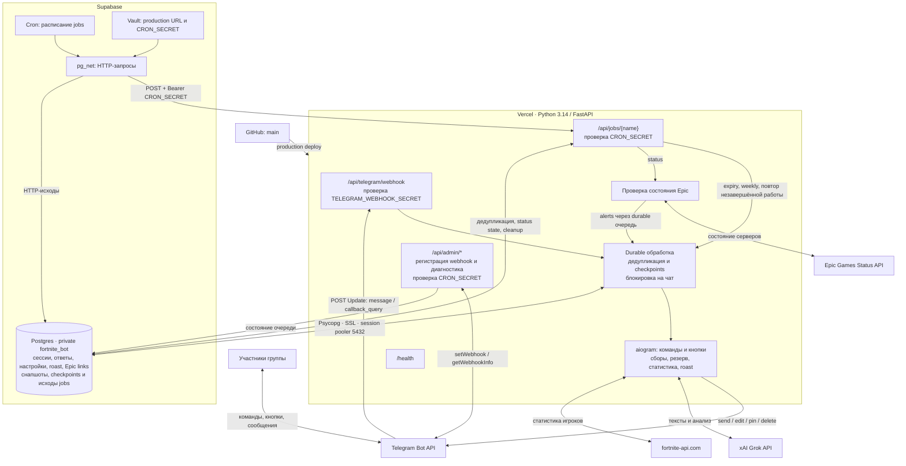

# Коробочка Fortnite Bot

Telegram-бот для сбора отряда из четырёх игроков: кнопки готовности, резерв,
статистика Fortnite, уведомления Epic и ответы Grok.

## Архитектура



**Jobs** — задачи по расписанию. Supabase Cron вызывает защищённые HTTP endpoints
на Vercel; постоянно работающий процесс для них не нужен.

| Job | Когда (МСК) | Что делает |
|---|---|---|
| `expiry` | Каждую минуту | Закрывает просроченные сборы и повторяет незавершённую обработку. |
| `status` | Каждые 3 минуты, 18:00–24:00 | Проверяет Epic и отправляет уведомления об изменениях. |
| `weekly` | Каждые 5 минут, пятница 21:00–21:59 | Публикует недельную статистику один раз; молчит без данных. |
| `cleanup` | Ежедневно в 04:00 | Удаляет снапшоты старше 30 дней. |

Состояние хранится в Postgres. Завершённые действия при повторе не выполняются заново;
неопределённый результат отправки сохраняется для проверки. Grok использует `XAI_API_KEY`.

## Команды

Команды работают в группах. Боту нужны права на закрепление и удаление сообщений.

| Команда | Назначение |
|---|---|
| `/fort [час]` | Создать сбор; первые четыре игрока — состав, следующие четыре — резерв. |
| `/rm` | Отменить текущий сбор. |
| `/afk 1d`, `/afk off` | Временно отключить приглашения или вернуть их. |
| `/fortemoji`, `/fortemoji off` | Администратору: настроить заголовок сбора из custom emoji. |
| `/stats` | Статистика сборов в чате. |
| `/roast on [вероятность]`, `/roast off` | Включить или выключить ответы Grok. |
| `/linkepicfor @user EpicName` | Администратору бота: привязать публичный Epic-аккаунт. |
| `/myfnstats` | Личная статистика Fortnite за сезон. |
| `/teamstats` | Статистика команды за неделю; также публикуется по пятницам в 21:00 МСК. |

## Разработка

Python 3.14, uv и отдельная локальная база Postgres.

```bash
cp config.example .env
uv sync --frozen
uv run python -m bot migrate
uv run python -m bot serve
```

Для локальной базы без SSL задайте `DATABASE_LOCAL_TEST=1`.
Проверка: `uv run ruff check` и `uv run ruff format --check`.
Тесты очищают таблицы: запускайте их только с отдельной базой через
`TEST_DATABASE_URL=postgresql://localhost/fortnite_test uv run pytest -q`.

## Production

FastAPI на Vercel (`fortnite-collect-bot`) и Supabase Postgres, Telegram webhook.
Деплой только из `main`; preview отключены. Подключение к Supabase — session pooler
на порту 5432 с SSL. Расписание задач — [Supabase Cron](ops/schedules.sql).

Обязательные настройки: `BOT_TOKEN`, `TELEGRAM_WEBHOOK_SECRET`, `CRON_SECRET`,
`PUBLIC_BASE_URL` и `DATABASE_URL` либо интеграционный `POSTGRES_URL_NON_POOLING`.
Дополнительно: `XAI_API_KEY` для Grok, `FORTNITE_API_KEY` для статистики,
`ADMIN_USER_ID` для привязки аккаунтов. Пример — [config.example](config.example).
Все `.env`-файлы исключены из Git.
